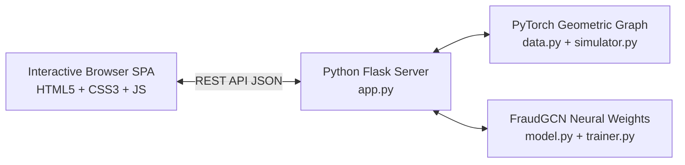

# AegisGNN - Interactive Financial Fraud Dashboard Guide

Welcome to your newly upgraded, highly premium **GNN Financial Fraud Analytics Platform**! We have successfully transformed a command-line pipeline into an ultra-modern, user-friendly **Single Page Application (SPA)** dashboard. This allows compliance analysts, risk officers, and developers to easily run simulations, train deep learning GNN models, inspect flagged high-risk entities, and forensically map suspicious multi-hop transactions interactively inside their web browser.

---

## 🛠️ What We Have Done (Completed Milestones)

We have built a sleek, zero-boilerplate client-server architecture:



### 1. Unified Backend API (`app.py`)
* **Dynamic Simulation Router (`/api/simulate`)**: Allows customized slider configurations for user nodes and normal transaction logs, injecting criminals, collections, and layered smurfing loops in real-time.
* **Neural Graph Builder Router (`/api/process`)**: Cleanly compiles raw simulated CSV transactions into PyTorch Geometric format, returning graph topology attributes.
* **GNN Trainer Router (`/api/train`)**: Runs the robust 2-layer `FraudGCN` model on PyTorch, capturing epoch-by-epoch loss reduction arrays and evaluating real-time confusion matrices (Accuracy, Precision, Recall, F1).
* **Suspect Directory Ledger (`/api/suspects`)**: Pulls threat levels across all nodes using GNN weights, tagging nodes with color-coded risk scales.
* **Forensic Ego-Graph Compiler (`/api/investigate/<suspect_id>`)**: Translates deep local message-passing paths (N-Hop neighborhoods) into a highly descriptive JSON format for browser graphing.

### 2. Premium Interactive Frontend (`web/` Directory)
* **`index.html`**: Structured using modern semantic elements and loaded with powerful third-party visualization assets (**Chart.js** and **Vis.js**) via secure, lightning-fast CDNs.
* **`style.css`**: Styled with an exquisite, premium **Obsidian & Neon Glassmorphism theme**:
  * Harmonious HSL colors featuring glowing primary cyan highlights.
  * Deep translucent cards (`backdrop-filter: blur(12px)`) sitting over moving background glow orbs.
  * Sleek tabular lists, range sliders, custom forms, and spinning radar loading icons.
* **`app.js`**: Houses the dynamic DOM logic:
  * Restores buttons and status indicators dynamically based on existing data folders upon refreshing.
  * Renders real-time animated epoch curves of GNN training loss.
  * Renders a fully physics-driven, drag-and-drop, zoomable transaction graph. Hovering over a node displays exact compliance metrics (role, threat rating, average transaction amounts).

---

## 🚀 How to Run and Operate

### 1. Launch the Server
The dashboard server has been successfully set up and is running locally. You can boot it up at any time by executing:
```bash
python app.py
```
This will start the Flask server hosting the platform on **`http://127.0.0.1:8080`**.

### 2. Access the Dashboard
Open your web browser and navigate to:
👉 **`http://127.0.0.1:8080`**

### 3. Step-by-Step Platform Ingestion Walkthrough

1. **Simulator Sandbox**: Adjust sliders for **User Nodes** and **Normal Transactions** then click **`Run Simulation`**.
2. **Compile the Graph**: The **`Build Neural Graph`** button will unlock. Click it to convert raw CSV records into the spatial graph structure.
3. **GNN Deep Learning Training**: Set epochs (e.g. 100) and click **`Train FraudGCN`**. Watch the training loss drop in real time!
4. **Forensic Network Investigation**: The Risk Directory ledger will populate. Click the **`Investigate`** (crosshairs) button on any suspect. An interactive, physics-driven network will animate, allowing you to drag nodes and explore transaction loops.

---

## 🔮 Future Enhancements (What Can Be Done)

1. **Interactive Real-Time Transaction Injector**: Manually inject transactions and see threat scores recalculate in real-time.
2. **Model Architecture Switcher**: Support switching between GCN, GAT, and GraphSAGE models.
3. **Database Integration**: Switch from local CSV logs to SQL/Graph Databases for production readiness.
