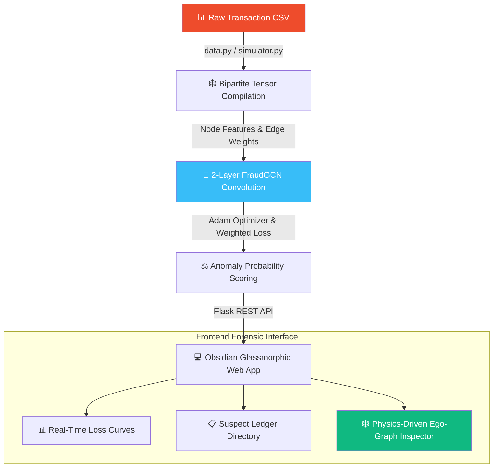

<div align="center">

# 🛡️ AegisGNN — Relational Financial Crime Intelligence

[](https://git.io/typing-svg)


<br/>

[](http://127.0.0.1:8085)
[](https://github.com/mayank-goyal09/financial-fraud-gnn/stargazers)
[](https://github.com/mayank-goyal09/financial-fraud-gnn/network)

<br/>

### 🧠 **Using Graph Neural Networks to detect multi-hop anomalies & launder networks** 
### **From Transaction Logging → Forensic Ego-Graph Network Investigations** 🛰️

</div>

---

## ⚡ **THE ANOMALY DETECTION ENGINE AT A GLANCE**

## ⚡ **THE ANOMALY DETECTION ENGINE AT A GLANCE**

### 🎯 **What AegisGNN Does**

AegisGNN is a state-of-the-art **deep learning financial intelligence pipeline** designed to map transaction logs to spatial network graphs, train an advanced Graph Convolutional Network (`FraudGCN`) to classify nodes, and expose hidden criminal syndicates via an Obsidian-themed forensic web dashboard.

**Core Pipeline Pillars:**
* 🎲 **Behavioral Simulation** → Models smurfing loops, cash mules, and structuring in real-time.
* 🕸️ **Spatial Graph Ingestion** → Compiles raw CSV logs into PyG bipartite transaction and user nodes.
* 🧠 **Neural Message Passing** → Trains a robust 2-layer Graph Convolutional Network on relational features.
* ⚖️ **Imbalance Handling** → Weights classification penalties $10\times$ higher for positive fraud anomalies.
* 🔍 **Interactive Vis.js Sandbox** → Physics-driven, drag-and-drop $N$-hop neighborhood forensic tracer.

### ✨ **Detection Typologies Grid**

| Threat Topology | Pattern Description | Risk Scale |
| :--- | :--- | :---: |
| 🌀 **Smurfing Rings** | 1 Boss $\rightarrow$ 100 Smurfs $\rightarrow$ 1 Consolidation Hub | **CRITICAL** (100%) |
| 💸 **Criminal Outflows** | Large asset dispersals to randomized retail entities | **HIGH** (90%) |
| 🪓 **Collector Mules** | Rapid asset accumulations from disjoint clusters | **HIGH** (85%) |
| 🌉 **Bridge Entities** | Covert transit vectors linking isolated subnetworks | **MODERATE** (40%) |
| 🟢 **Normal Activity** | Regular localized peer-to-peer transaction flows | **LOW** (0.1%) |

---

## 🛠️ **TECHNOLOGY & ARCHITECTURE STACK**

<div align="center">


</div>

| **Category** | **Technologies** | **Role & Implementation** |
|:------------:|:-----------------|:--------------------------|
| 🐍 **Core Engine** | Python 3.9+ / Pandas / NumPy | Primary pipeline script and tensor data parsing. |
| 🧬 **Deep Learning** | PyTorch / PyTorch Geometric | Model architecture, spatial convolutions, and edge features. |
| 🕸️ **Network Parsing** | NetworkX / Vis.js | Bipartite graphs, N-hop neighborhood extractions, and physics-driven layouts. |
| 🔌 **Server & APIs** | Flask / Flask-CORS | REST API router providing real-time training outputs and suspect registers. |
| 🎨 **UI/UX Design** | HTML5 / CSS3 (Obsidian Glassmorphism) | Glassmorphic neon cards, custom HSL glows, and dynamic console logs. |
| 📊 **Scientific Charts** | Chart.js | Dynamic animated training loss curves. |

---

## 🔬 **DATA PIPELINE & MESSAGE PASSING FLOW**



### **Technical Pipeline Breakdown:**

---

#### 1. Bipartite Graph Compiling 🕸️
Standard tabular databases ignore deep relational connections. AegisGNN converts raw logs into a bipartite topology where **Users** and **Transactions** are individual nodes, and transaction flows are mapped as weighted edges:
$$\text{Sender User} \xrightarrow{\text{Edge}} \text{Transaction Node} \xrightarrow{\text{Edge}} \text{Receiver User}$$

---

#### 2. Spatial Convolution (`FraudGCN`) 🧠
We employ spatial message-passing graph convolutions to aggregate neighboring attributes:
$$\mathbf{x}_i^{(k)} = \mathbf{\Theta}^{\top} \sum_{j \in \mathcal{N}(i) \cup \{i\}} \frac{1}{\sqrt{\hat{d}_i \hat{d}_j}} \mathbf{x}_j^{(k-1)}$$
This captures spatial behavior (e.g. high frequency, night-trading, smurfing structures) from surrounding transaction chains to identify outliers.

---

#### 3. Class Imbalance Mitigation ⚖️
Because financial fraud is naturally rare ($< 5\%$ of total bank activity), regular models bias heavily towards legitimate labels. AegisGNN implements a weighted Negative Log-Likelihood Loss ($10\times$ penalty weight on true positive fraud nodes) to force the model to identify criminal patterns.

---

#### 4. Live Forensic Sandboxing 🔬
Integrates PyG's `k_hop_subgraph` to dynamically query and extract local transaction networks of targeted suspect accounts in real-time. Compliance officers can visually trace, drag, and examine transaction flow directions.

---

## 📂 **PROJECT BLUEPRINT**

```text
🛡️ AegisGNN/
│
├── 📂 data/                    # Data Repository
│   ├── raw_transactions.csv    # Simulated transactional dataset
│   ├── processed_graph.pt      # Serialized PyTorch Geometric Hetero-Graph
│   └── trained_model.pt        # Optimized GNN model weight checkpoints
│
├── 📂 notebooks/               # Research Laboratory
│   └── main.ipynb              # Jupyter notebook for custom visualizations
│
├── 📂 src/                     # Core Deep Learning Pipeline
│   ├── data_processor.py       # Cleans & maps transaction logs to a Graph
│   ├── model.py                # FraudGCN PyTorch Neural Module
│   ├── trainer.py              # Loss optimization & model training scripts
│   └── visualizer.py           # NetworkX static ego-graph plotter
│
├── 📂 web/                     # Obsidian-Glassmorphism SPA Frontend
│   ├── index.html              # Clean semantic structural HTML interface
│   ├── style.css               # Translucent neon glassmorphism CSS stylesheets
│   └── app.js                  # Vis.js network compiler & dynamic DOM controllers
│
├── 📊 app.py                   # Central Flask REST API server
├── 🚀 main.py                  # End-to-end command-line orchestrator
├── 📦 requirements.txt         # Primary python environment dependencies
└── 📖 README.md                # You are here! 🎉
```

---

## 🚀 **GETTING STARTED & LAUNCH GUIDE**

### **Step 1: Clone the Repository** 📥
```bash
git clone https://github.com/mayank-goyal09/financial-fraud-gnn.git
cd financial-fraud-gnn
```

### **Step 2: Create a Clean Environment** 🐍
```bash
python -m venv venv
source venv/bin/activate   # On Windows: venv\Scripts\activate
```

### **Step 3: Ingest Dependencies** 📦
```bash
pip install -r requirements.txt
```

### **Step 4: Launch the Deep Learning Engine** 🛡️
Execute the command-line orchestrator to simulate the banking transactions, compile the graph tensors, train the GNN model, and run initial evaluation metrics:
```bash
python main.py
```

### **Step 5: Fire Up the Glassmorphic Web App** 💻
Launch the central Flask dashboard server:
```bash
python app.py
```
Open your browser and navigate to the live forensic interface:
👉 **`http://127.0.0.1:8085`**

---

## 🔬 **SKILLS DEMONSTRATED**

* **Deep Representation Learning**: PyTorch Geometric, spatial GCN layers, node classification pipelines.
* **Complex Data Modeling**: Bipartite graph compilation, relational databases, tensor transformations.
* **Explainable AI (XAI)**: $N$-hop neighborhood extractions, ego-graph isolations, audit trails.
* **Premium Fullstack MLOps**: REST API construction, dynamic client-server caching, responsive Obsidian-glassmorphism interfaces.
* **Mathematical Optimization**: Addressing class imbalance, weighted loss formulations, regularizations.

---

## 🔮 **FUTURE UPGRADES**

- [ ] 🔄 **Attention GNNs**: Upgrading `FraudGCN` to Graph Attention Networks (`GATConv`) to weigh node edges dynamically.
- [ ] ⏱️ **Real-Time Transaction Injector**: An interactive web form to inject live transactions and watch risk ratings update dynamically.
- [ ] 🗄️ **Neo4j / SQL Integrations**: Interfacing local graph databases with real production data.
- [ ] 🤖 **LLM Forensic Copilot**: Generating automated NLP compliance reports for suspicious transacting networks.

---

## 👨‍💻 **CONNECT WITH ME**

<div align="center">

[](https://github.com/mayank-goyal09)
[](https://www.linkedin.com/in/mayank-goyal-4b8756363/)
[](https://mayank-goyal09.github.io/)

**Mayank Goyal**  
🧠 GNN & Deep Learning Architect | 📊 Financial Intelligence Specialist | ⚖️ MLOps Engineer

</div>

---

<div align="center">

### 🛡️ **Built with AI & ❤️ by Mayank Goyal**

*"Exposing hidden loops, uncovering financial truth."* 🛡️🕸️🧠


</div>
